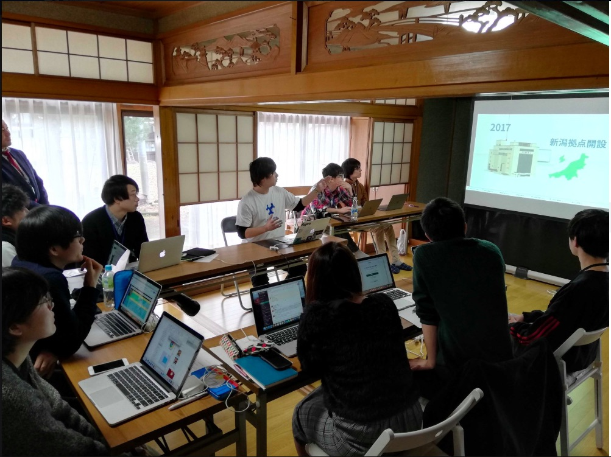

---

### Welcomeランチatぶら坊

 

インターン初日は六日町駅に集合した後、駅前にある[ぶら坊](https://www.facebook.com/burabouburabou/)というお店へ。
 

インターン生とフラーの社員の皆さん、協力してくださる南魚沼市の方とお話をしながらランチ。
 

南魚沼名物のマジ丼をいただく（地元だけど初）。
ちなみに、南魚沼市は海に面していないけど、海鮮が美味い！
 

ちなみにこのお店はナポリタンやグラタンも有名（バナナマン日村が食べてた）。
 

---
 

### いざ、戦場の地へ

 

　お昼の後は、合宿会場となる兼続庵に移動。

 

元お蕎麦屋さんのここはまさに古民家らしい雰囲気。
 
 

インターンのガイダンスを行なった後、地元企業３社からのプレゼン。

事業内容や抱えている課題などを聞いて、南魚沼の課題解決の材料に。
 

採用担当の生の声の聞いて、チーム毎に今後の作戦会議スタート！

こうして1日目は無事終了〜
 
 

---

【説明していただいた企業】
 
- [セキ技研株式会社](http://www.sekigiken.co.jp/)　
- [粉研パウテックス](https://www.funken.co.jp/)
- [高速紙工業](http://www.kamikogyo.com/)

