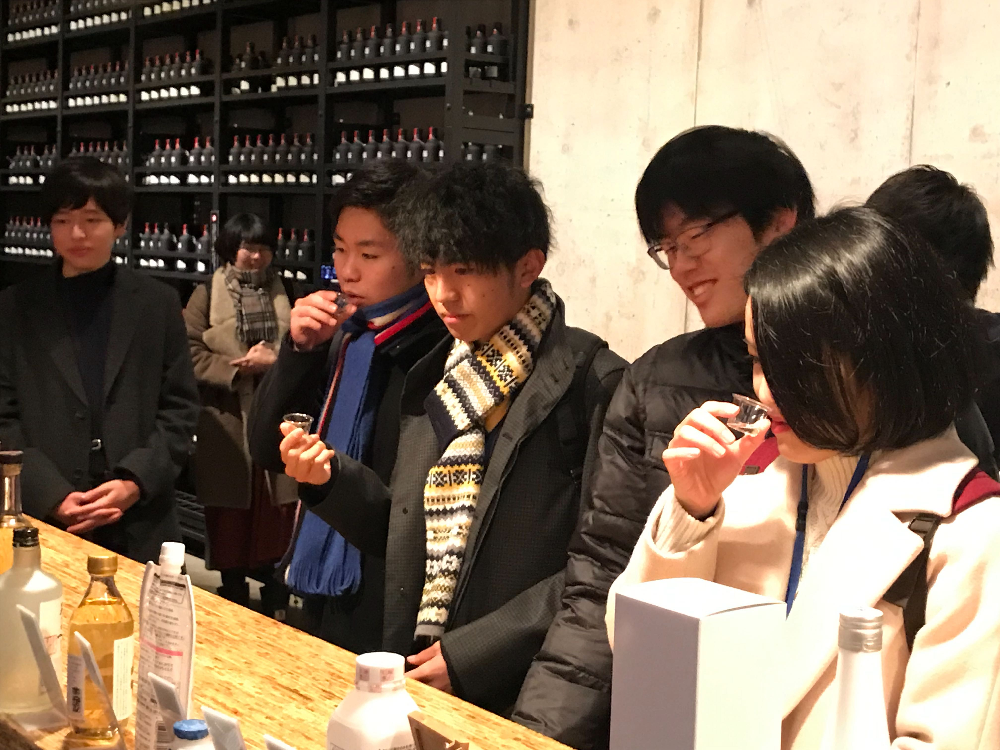
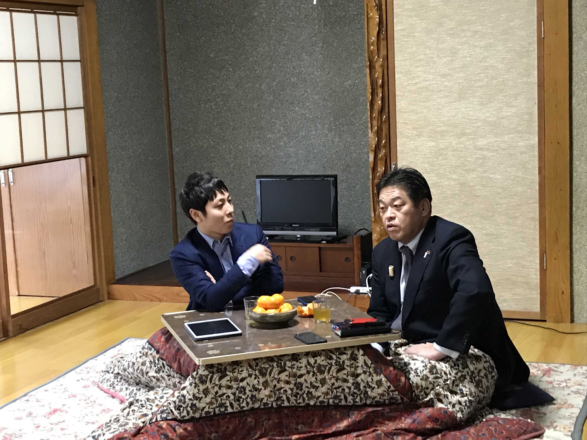

---

### 雪室体験
 
 

２日目は、始めに[魚沼の里](http://www.uonuma-no-sato.jp/)へ。
 

名酒”八海山”を作る[八海醸造](http://www.hakkaisan.co.jp/)の施設、雪室を見学。
 

 

天然クーラーで一年中施設内の気温をキープ。
 

日本酒は一定温度で発酵することでより美味しくなるらしい。  
 

 
施設内にあるバーカウンターでお酒を試飲している様子。
 

残念ながら僕はまだ飲めないので、甘酒をいただきました。
 

八海醸造が製造している「麹だけでつくったあまさけ」は色々なものに合います。（ここではジャムと混ぜてブルーベリーラッシーに！）
 
 

普通は見ることのできない施設を見学でき、貴重な体験でした。

---
 

魚沼の里を楽しんだところで兼続庵に戻ると・・・

### ついに降臨

 

#### こたつに渋谷社長が！！！
 

このためにインターンを申し込んだと言っても過言ではない、ついに憧れのフラーのCEO・渋谷さんと会えました…！

やはりオーラがすごい。（~~テレビの取材より緊張した~~）
 

コタツにあたりながら対談という珍しい光景でした（笑）
 

会社と地方自治体のリーダーというお互いの視点から述べられる意見はとても新鮮でした。
 

南魚沼の魅力である、美味い飯と綺麗な空気、そして周りが静かなことが良い作業環境であると述べていました。
 

確かに、騒音で気が散るということもこっちに住んでいるとほとんどありません。
 

地元にいると気づかない良さを発見しました！

そして市長も渋谷さんもやっぱりアクティブ、地方創生にも取り組むフラーさんと南魚沼市やその他の地域が今後も何らかの形でコラボしてほしいです！

2日目もあっという間に終了〜。

