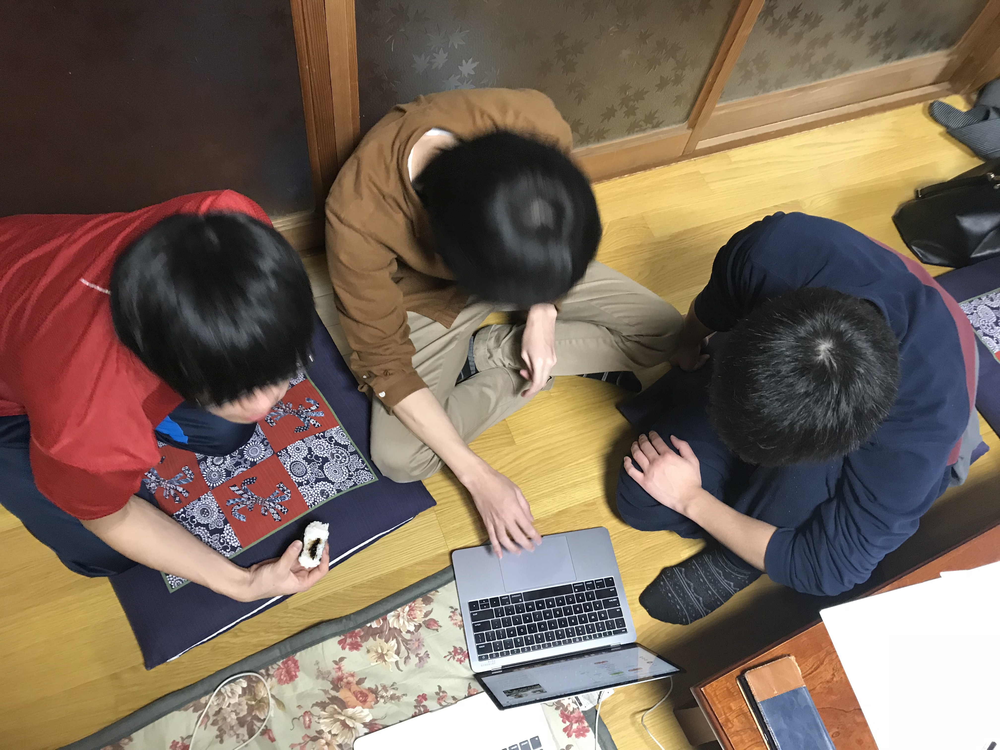
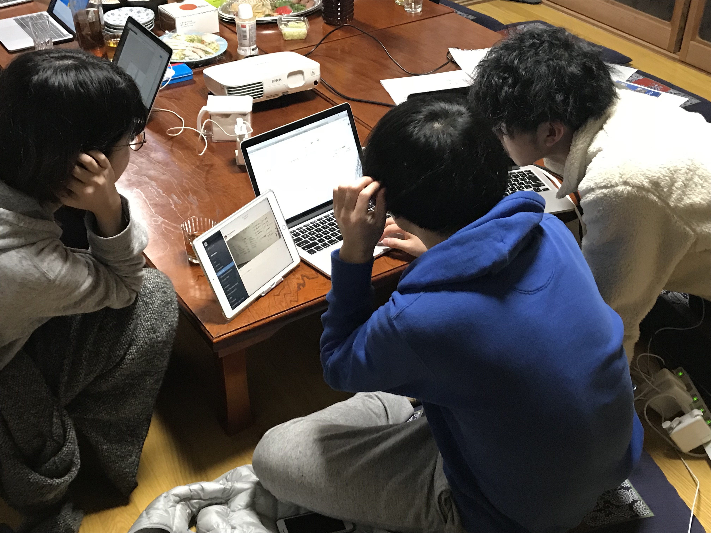

---

### チーム開発始動

 

課題解決の方針が決まってきたので、本格的に開発スタート！
 

皆さん真剣に取り組んでおりました。
 

色々な人からお話を聞いてペルソナ（ユーザー像）を考え、イメージをより具体的に。
 

---
 

### 本日の昼食はリトル北海道

 

昼食は六日町商店街にある[リトル北海道](http://www.sep-i.co.jp/little/)へ。
 

こちらでもマジ丼をいただきます。

海の幸が輝いておりました。
 

エネルギーをもらったところで作業再開！

---

・・・

そんなこんなで、夕食の時間。
 

本日は渋谷社長を始め、フラーの重役のみなさんもご一緒に。

### 親戚の集まり感（笑）

 

こちらの料理を用意していただいたのは、一般社団法人[愛 南魚沼みらい塾](https://www.facebook.com/%E4%B8%80%E8%88%AC%E7%A4%BE%E5%9B%A3%E6%B3%95%E4%BA%BA-%E6%84%9B-%E5%8D%97%E9%AD%9A%E6%B2%BC%E3%81%BF%E3%82%89%E3%81%84%E5%A1%BE-1840740029287133/) の倉田さん。

インターンの宿泊、食事を担当していただいている方で、料理がめっちゃうまい…！
 

そしてこの大人数の為の準備を一人でこなす手際の良さ、おそるべし。
 

ごちそうさまでした！
 

---
 

夕食後はフラーCDO(チーフデザインオフィサー)の山崎さんによるデザインに関するプレゼン。  

「優れたデザインとは、それがデザインされたかどうかすらわからない。」

特にこの言葉が印象的、自分の中のデザインに対する印象がかなり変わりました！ためになりました。
 

美味いもんばっかりの３日目も終了〜

---
 

#### そしてようやく南魚沼でも雪が…

