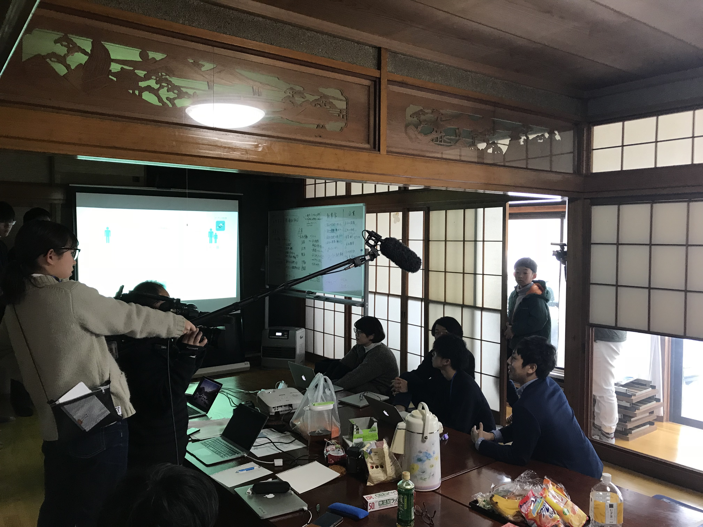

---

### 本日はチームの現状を報告する中間報告会から
 

それぞれのチーム毎にスライドで中間報告を行いました。内容は、
 

- 南魚沼の現状に基づく課題
- どこに注目したか
- どのようなやり方で解決をしていくか
- プロダクトの概要説明  

など
 

発表後に、渋谷さん（CEO）・山崎さん（CDO）・藤原さん（CTO）・畠山さん（SuperEngineer）からフィードバックを受けます。
 

それを踏まえて、今後の方針を改めて考えます。
 

### ・・その前に

雪合戦！！
 

テレビ局に撮影されながら、インターン生・メンター・社長など関係なく互いに雪玉をぶつけ合います！
 

カオスで楽しい雪合戦でした（笑）

眠気が吹き飛んだところで部屋に戻り、午後はミーティング。

---
 

そして本日の夕食は倉田シェフ特製カレー！

スパイスがいい感じに効いていて美味しかったです！

毎日、ごっつぉ（ご馳走）でした。

４日目終了、合宿も後半戦。

