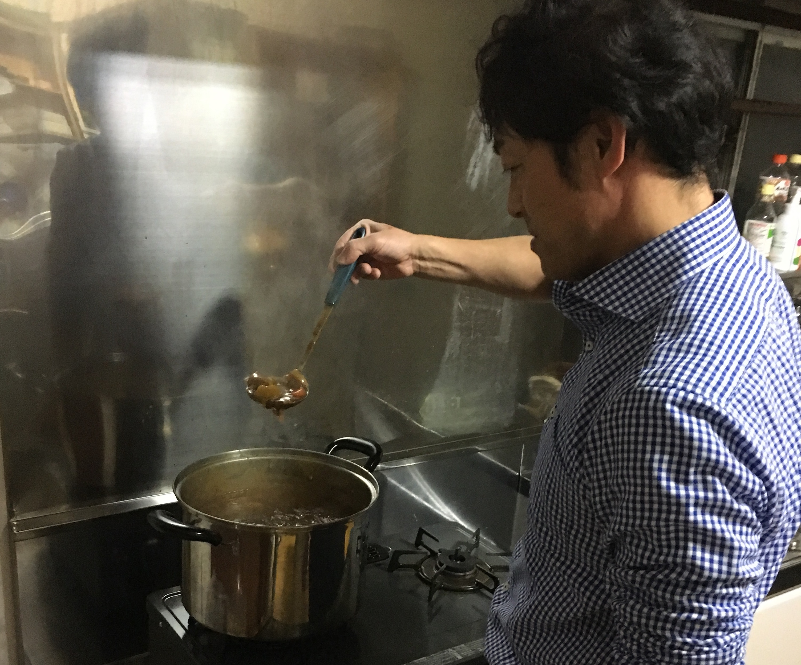

---

### 本日はチームの現状を報告する中間報告会
 

それぞれのチーム毎にスライドで中間報告。
 

- 南魚沼の現状に基づく課題
- どこに注目したか
- どのようなやり方で解決をしていくか
- プロダクトの概要説明  
 

などの内容をそれぞれ発表。

発表後に、渋谷社長・山崎さん（CDO）・藤原さん（CTO）・畠山さん（SuperEngineer）からフィードバックを受ける。
 

今後の方針を改めて考え、解決策を練る・・
 

#### その前に

雪合戦！！
 

テレビ局に撮影されながら、インターン生・メンター・社長など関係なく雪玉をぶつけ合う（めちゃくちゃカオス）。
 

眠気が吹き飛んだところで部屋に戻り、午後はミーティング。

---
 

そして本日の夕食は倉田シェフ特製カレー！
 

スパイスがいい感じに効いていて美味しかった、ここ数日ごっつぉ（ご馳走）ばかり食べとる。
 

#### ごちそうさまでした！
 

４日目終了、合宿も後半戦。

