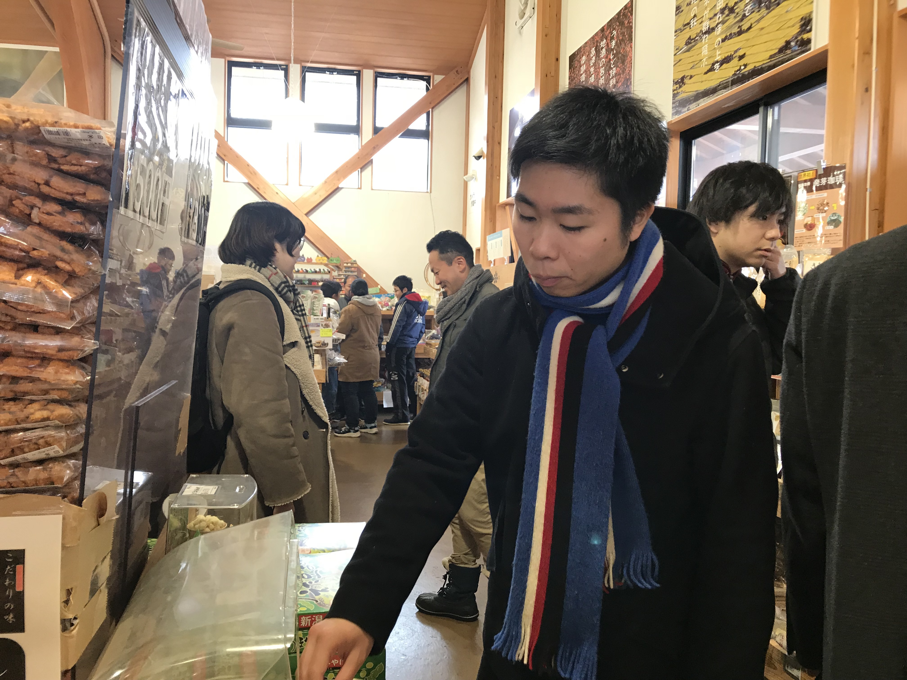
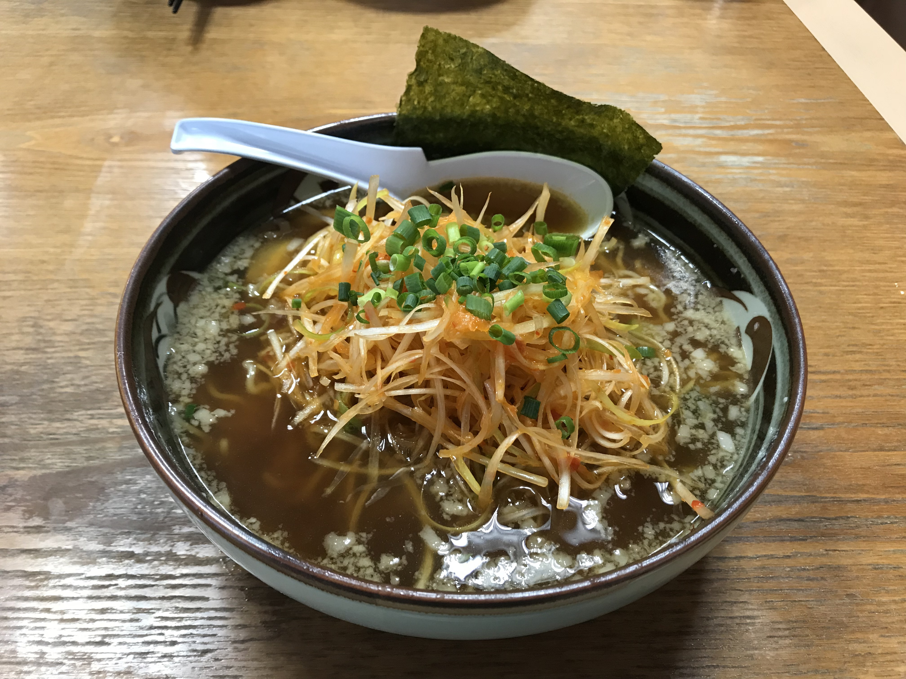

---

### 道の駅でお買い物
 

今日は南魚沼の道の駅「[雪あかり](http://www.city.minamiuonuma.niigata.jp/kanko/kanko_museum/eat/1455872578758.html)」へ。

ここで、お米やお酒など地元の名産品を購入しました。

魚沼エリアのお土産はほとんど網羅しているのでお越しの際は是非！

---
 

お昼は大好物のラーメンでした！

イオン六日町店の専門店街にある風々亭というお店へ。

魚沼ラーメンというジャンルがあるなんて知らなかったです。

写真はこのお店の一押し、味噌ラーメン。

### いただきやす！！
 

スープの味がちょうど良かったです、あっさりすぎずこってりすぎず。

麺の茹で加減もよかったです！

良いラーメン納めでした。

---
 

美味い飯を食べた後は、リリースに向けてラストスパート！
 

#### （このコーヒーフィルターの山が皆さんの努力を物語っている…）
 

ついに明日は成果発表会（この記事も焦りながら書いております）。

５日目もあっという間に終了〜

