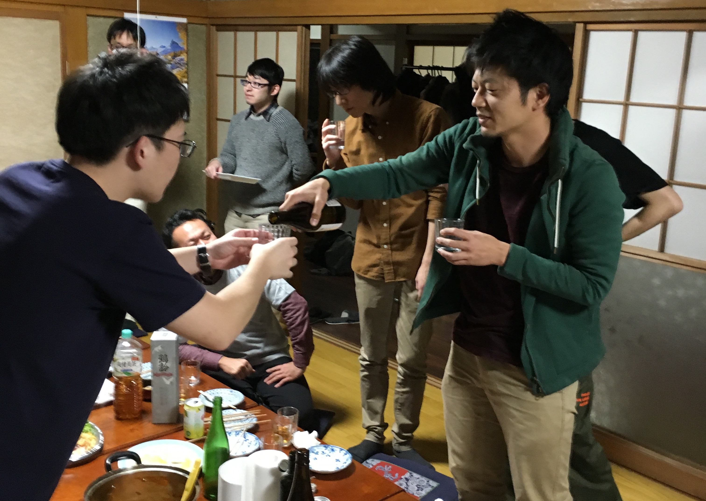
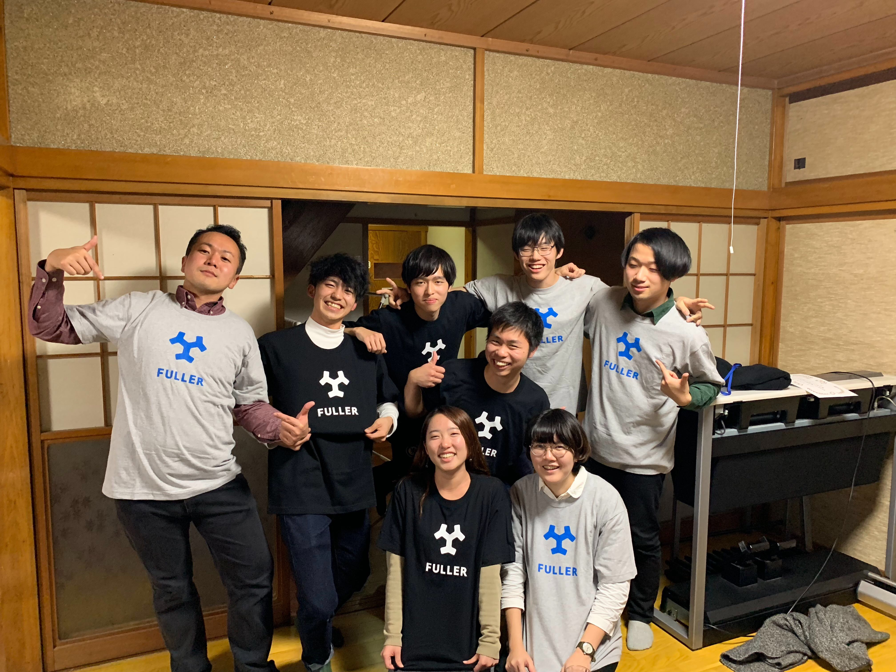

---

### 成果報告会に向けてラストスパート！
 
 

本日は、夕方に行われる最終成果報告に向けて集中モード。

みなさん大忙しなのであまり写真がございませんm(_ _)m

差し入れの限界感…笑

午後はプレゼンの練習やスライド作りなどもあり、ちょっと大変でした。

---
 

###最終報告会スタート

####まずはチームNHKから、「うおぬマッチ」

起業家と地元企業のマッチングという斬新なアイデア。

ネーミングセンスもいいと思います！

詳しくは開発プロダクトのページをご覧ください。
 
 
 

####続いてチームNewturnから、「Newtern」

企業の人材不足をシニア世代がお助けするというアイデアから生まれたアプリ。

こちらも開発プロダクトのページから詳細が確認いただけます。

注意）チーム名とスペルが異なります！
 
 
 

それぞれ素晴らしいチームの発表の後に僕の出番。

・・がしかし

####スクリーンに映す変換ケーブルを用意し忘れるという大失態。
 

やらかしました。大変失礼いたしました。

あと、プレゼンの準備をもう少し念入りにすれば良かったと思いました。

自分の中ではあまり納得のいく発表はできませんでした、反省です。

しかし、発表後に[セキ技研](http://www.sekigiken.co.jp/)さんから「一番情熱が伝わった」とお褒めの言葉をいただきました…！

とても嬉しかったです、やって良かったです。

---

###成果報告後は宴です！

共同代表の櫻井さん（COO,CCO）もいらっしゃいました！

インターン修了証とフラーのロゴTシャツをいただきました！

最後はみんなでワイワイ楽しめました〜

６日目も終了、あっという間に最終日です…

