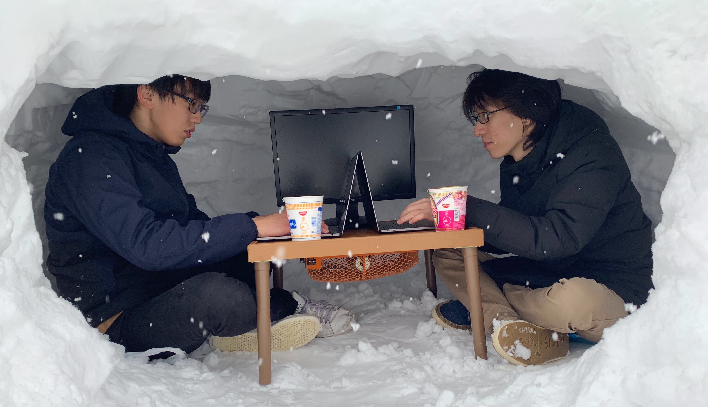
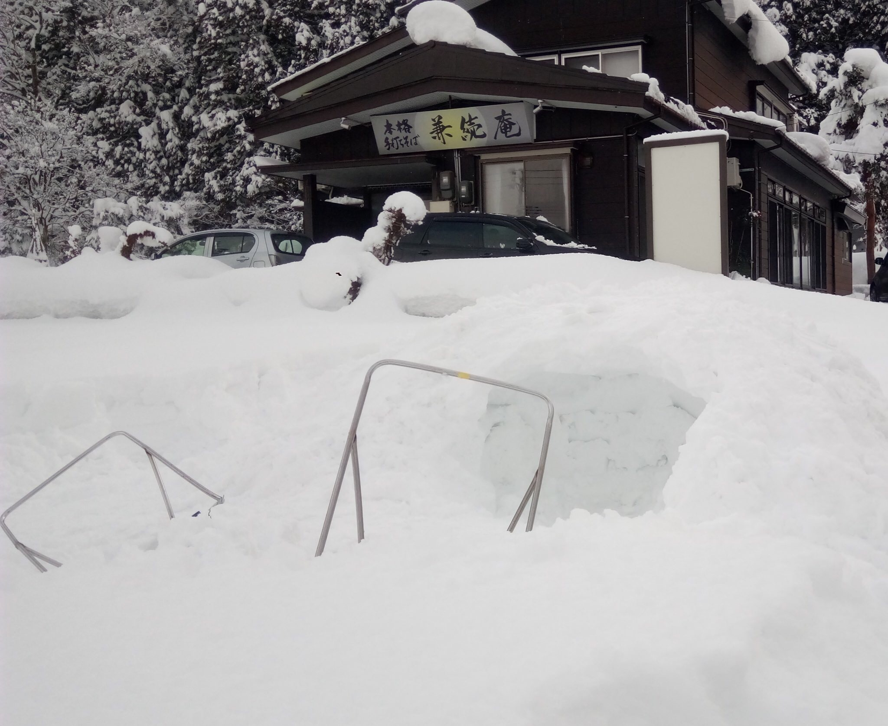
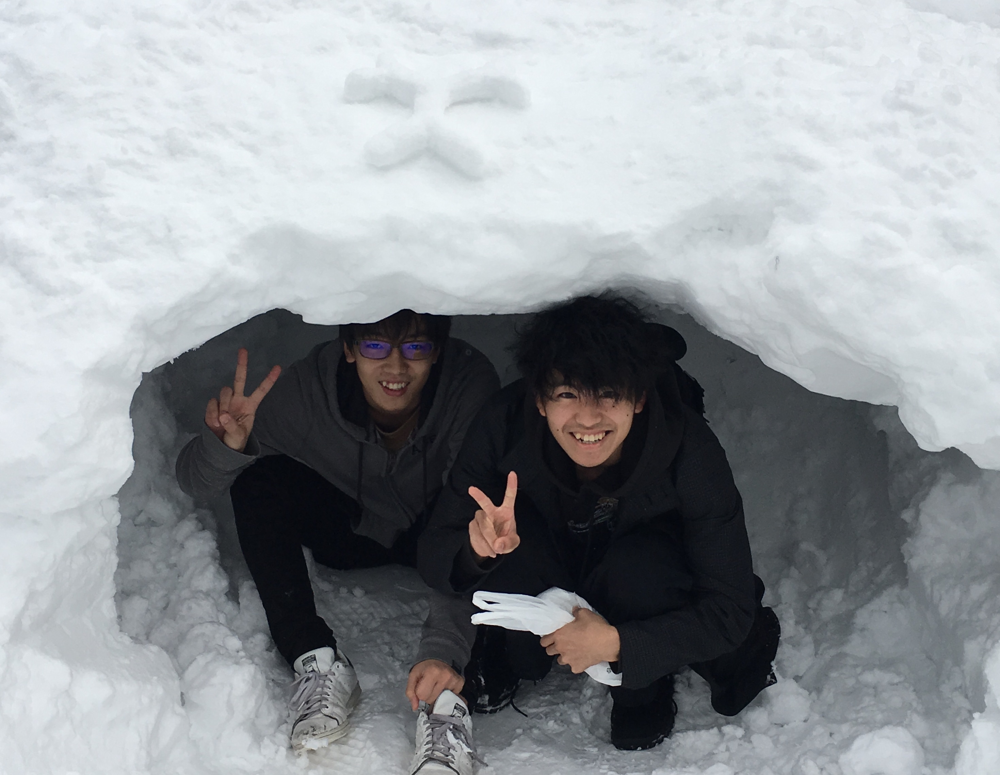
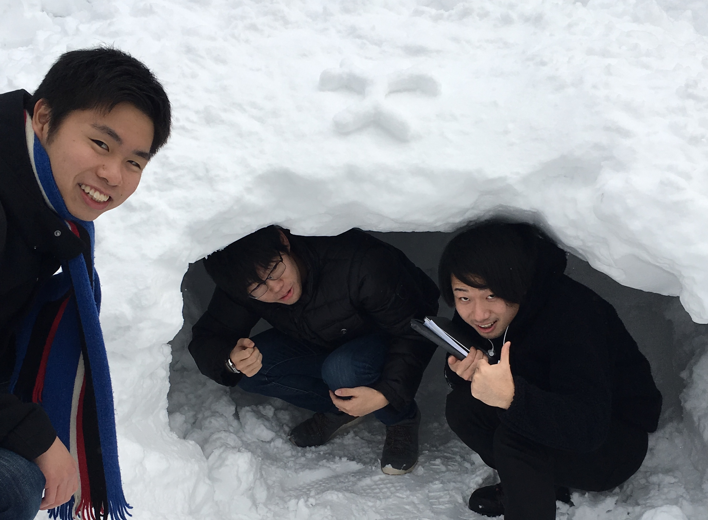
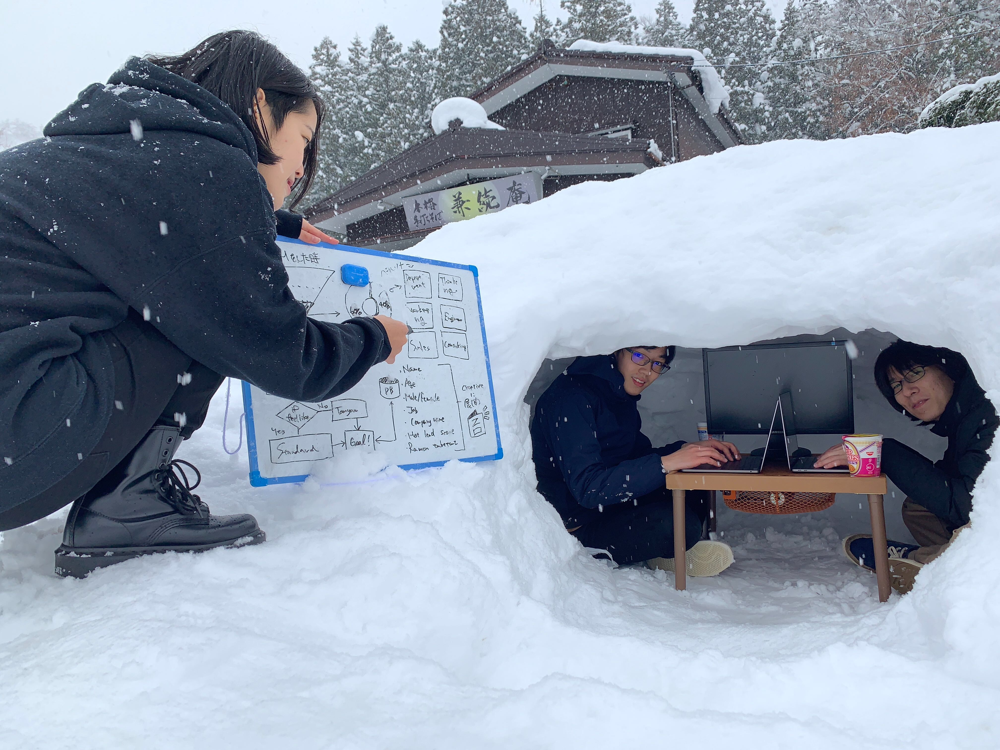

---
 

とうとう最終日、兼続庵ともお別れです。

何かやり残したような・・
 
 

###かまくらだ！

 

”かまくらでMacを開く”

これをしないで皆と解散するわけにはいかない…！

早起き苦手な自分が謎の使命感に駆られ、その日はすぐに起きて外へ。

雪国出身、元スキー場バイトとしてのプライドがあります。

それなりのクオリティーを出さねば。

早くしないとみんなが起きちゃうので必死で雪をかき集めます。

結局、出来上がる頃には何人かにバレてしまいましたが、なんとか完成！（製作時間２時間半）

Created by 僕、[Adam-Innovations](http://adam-i.jp/ja/) 茂木さん フラーのロゴは丸七さん作

ご協力ありがとうございました！

メンターの方の作業場として使っていただきました。

いい感じにPCが冷やせるのでおすすめです。
（かまくらでの作業による責任は負いかねます。）

最後にやって良かったです、さらば兼続庵。

---
 

###総括
 

あっという間の７日間でした、初日に漂っていた緊張感が嘘のようにみんな仲良くなってました。

正直こんな短期間で開発できるのかなと始めは思っていました。

しかし、気合と根性で案外いけましたね（笑）。

本当に良い年末を過ごせました。多くのことを学び、沢山の人と話せて視野が広がりました！

そして、自分も観光気分で南魚沼をめっちゃ楽しめました。地元にいるとあまり気づかないですが、いいところです。

最後まで見てくれてありがとうございました！ 個人的なインターン日記でした〜

