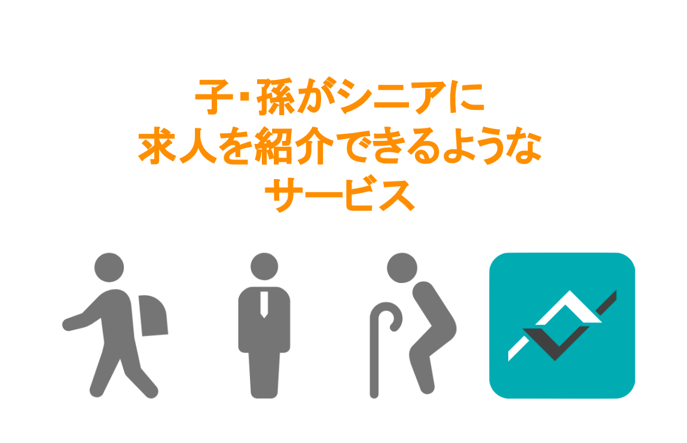
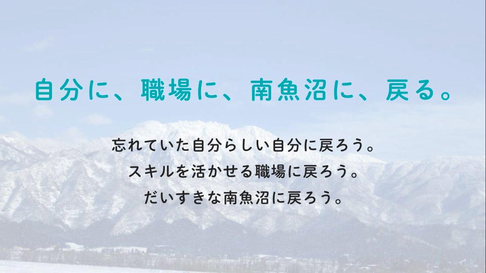
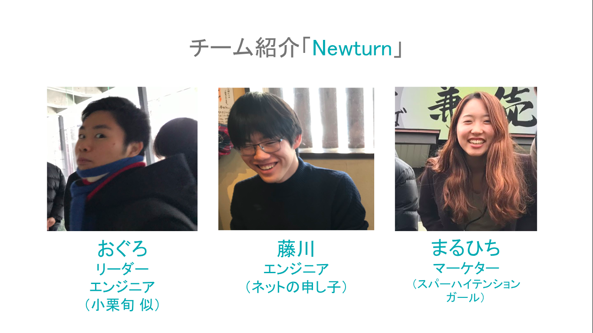

 

#  南魚沼の人材不足を解決するアプリ”Newturn”

---

フラー（千葉県柏市）が新潟県南魚沼市で開いたインターン冬の陣「イケてる古民家で、南魚沼市の課題を解決せよ」（２０１８年１２月２５日〜３１日）で、高専生や大学生で構成する開発チームが、南魚沼市の企業が課題とする「人材不足」に対し、シニアに働く場を提供することで解決を図るアプリ「Newturn」を開発しました。どのようなアプリか、このアプリでどんなことが期待できるのかを取材しました。

---

## 人材不足の企業とシニア世代をアプリでつなげる
 

求人アプリ「Neutern」は、人材不足にあえぐ南魚沼市の地元企業と、働く力や時間はあるものの就労機会に恵まれないシニア世代をつなげるアプリです。
特徴はシニア世代と企業を直接つなげるのではなく、シニア世代の子や孫にアプリを使用してもらい、それぞれの祖父母に合いそうな企業を3社ピックアップ。祖父母にはピックアップした企業の情報を記したカタログが配送され、孫や子が祖父母とコミュニケーションを図る中で企業への面接の可否などをなどを決めていくのが大きな特徴だ。

求人をしたい企業は、アプリ上で企業情報を入力し、広告料も払います。その後、一連の孫から祖父母への情報伝達とカタログ送付を経て面接の打診をアプリが通知。その後、シニア世代の求職者と直接やりとりができる仕組みです。広告料は月額単位で支払います。
アプリ使用者である孫は、アカウント作成と自分の祖父母に当たるシニア世代の求人に必要な情報を入力。入力した情報を元に表示された企業情報の中から、祖父母に適していそうな企業を選択し、カタログを祖父母の自宅へ送付する手続きをアプリ上で完了させます。
 

配送状況や到着通知はアプリ上で逐次表示。カタログ到着後にに伴い、祖父母に電話をして面接の可否を決めた上で面接日を決定し、アプリで面接日を入力する仕組みです。
シニア世代は、カタログが到着して子や孫と電話で話すところからアプリに伴う体験が始まります。子や孫と話して、働きたい企業・面接日を決定した後、。企業から直接電話がかかってきます。
実際の面接を経て、企業に就職するという流れになります。

---

## アプリの特徴「給料の一部が子や孫に還元される」
 

給料がシニア世代に払われる際、その一部がアプリ運営者にも支払われ、その一部が子や孫のポイントとなるのも、今回のアプリの大きな特徴です。ポイントは南魚沼市限定で使用可能。祖父母と一緒の場合に使用可能という制限もあり、子や孫がシニア世代がコミュニケーションをとるきっかけ作りに役立ちます。アプリをきっかけに南魚沼市に帰ってくることで、南魚沼市の魅力にあらためて気づくという仕掛けも用意しています。
 
 

## コンセプトは「自分に、職場に、南魚沼に、戻る」
 

サービスのコンセプトは「自分に、職場に、南魚沼に、戻る」です。アプリ名の「Newturn」は、「新しいUターンやIターンのような仕組みを作る」というコンセプトで命名。本アプリを開発したチームの名前にもなっています。

## アプリのコラムや電話で温かみを生み出す
 

シニア世代にアナログ（紙）でカタログを送ったり、孫が祖父母に電話をしたりするなど、アプリにはアナログな仕掛けが用意されています。開発チームのマーケター**丸七**さんは「仕事とかアプリはそれだけだと端的で冷たいものですが、私たちのアプリはそれに温かみを加えるんです」とこだわりを強調します。
アプリの起動画面には、南魚沼市に関連する企業の社員の写真とコラムも表示します。ただの起動画面ではなく、自身の故郷や祖父母の住む南魚沼市を思い出せるという「温かさ」にこだわります。
 
 

## なぜシニアなのか？
 

そもそも、企業の課題解決の人材としてシニアを選んだのでしょうか丸七さんは「もともと若者の転出率が多い南魚沼市に関して、同市の＊＊市長とフラーの渋谷代表の対談で、若者は外に出て、吸収して帰ってきてほしいという思いがあることを感じ、課題解決のためには地元に残っているシニア世代の知識やスキルを生かしながら、若者との接点を生み出すことで、新しい形のUターンにつながるのではないかとひらめきました」と強調します。
 
 

地方の企業にとっても、シニア世代への求人の手段はハローワークや新聞の求人広告だけの現状を変え、新たな切り口として、これまでリーチできなかったシニア世代にも企業の情報がアプリを通じて届けることができるようになります。
 

子や孫にとっても、一連のアプリ利用により、祖父母世代との交流の機会が生まれます。「温かさ」や「自分に、職場に、南魚沼に、戻る」というテーマやコンセプトを掲げるチームならではのユーザーに提供するメリットのアプローチで、新たな切り口から地元の活性化につなげようと、チームメンバーは意気込みます。
 

「このアプリを通じて、おじいちゃん・おばあちゃんと繋がるきっかけとして使ってほしいです。また、南魚沼の魅力を再認識できるきっかけとして使ってほしいです」と丸七さん。
随所で出てきた「温かさ」を感じながら「新しい里帰り」の形を求人アプリ「Newturn」は提供してくれるかもしれません。
 

## 開発チーム「Newturn」について
 

最後に本アプリを開発した「Newturn」について。
* 丸七
* 藤川
* 小黒
という3名の学生によるチーム。

 

特徴は
* 口癖の悪いチーム。
* 圧倒的センスチーム。
* 温かみを大事にしている。ネットとかアプリだけだと冷たい印象があるから、アナログな方法をサービスに取り入れている。
とのこと。

