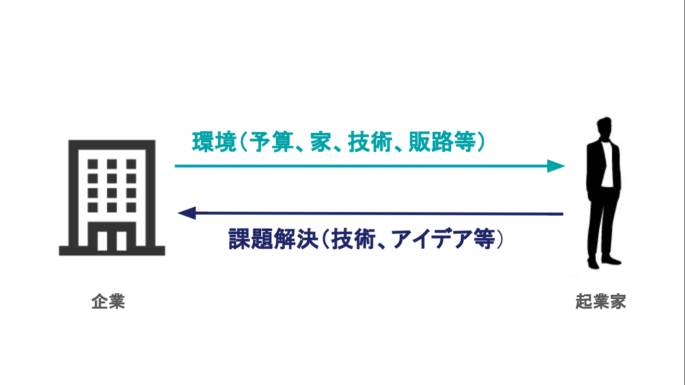
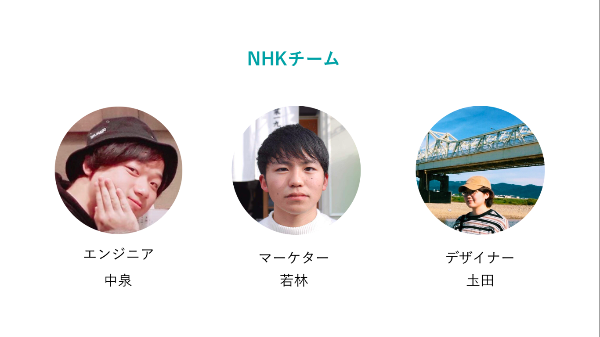

 

フラー（千葉県柏市）が新潟県南魚沼市で開いたインターン冬の陣「イケてる古民家で、南魚沼市の課題を解決せよ」（２０１８年１２月２５日〜３１日）で、高専生や大学生で構成する開発チームが、地元企業と起業家の橋渡しを図るスマートフォン（スマホ）アプリ「うおぬマッチ」を開発しました。
同市の企業の多くが課題とする「人材不足」に対し、ITという新たな切り口で解決を図る同アプリについて、開発の背景やアプリに込めた思いなどをチームメンバーに取材しました。

---

## 人材不足に新た切り口で挑む
 

南魚沼市をはじめとする地方が抱える課題として、企業の「人材不足」があります。解決策として、多くの自治体では雇用拡大を図るための公共事業の拡大や企業誘致に躍起になっていますが、実際には調整などに時間がかかり、人材不足の特効薬になりにくという課題があります。また、単純な労働力としての人材だけでなく、都市圏に人とともに企業に新しい事業を提案するようなアイデア・知識・スキルをもつ人が集中してしまっているという構造的な課題も存在します。
 

こうした背景を踏まえ、今回開発したアプリは、直接雇用を生み出すのではなく、地元の企業と大都市圏などで活動する起業家をマッチングすることに焦点を当てています。地元企業が抱える課題を起業家が自身のアイデアやスキルで解決する代わりに、地元企業が保有する場所や環境、資金などを起業家に提供することで手助けします。地元企業に足りない課題解決のブレーンとなる人材と、多くの起業家が求めている資金調達やオフィス環境の整備を、お互いに、アプリを通じて補い合う形です。

（上の画像は新たな化学反応を表現しているという「うおぬマッチ」ロゴ。）

---

## アプリがマッチング、チャットで課題をやり取り
 

最初にアプリを起動すると、地元企業は
▽会社の概要▽抱えている課題▽起業家に提供してほしいソリューションーーなどを記入します。
起業家は、▽興味のある業種▽やりたいことと希望する環境を記入。
 

すると、アプリに企業が登録した情報をもとにマッチングをして、起業家側の画面には関連度が高い順に地元企業の情報が一覧で表示されます。一覧で得た情報をもとに、自分が解決できる課題を持つ地元企業に対し自身の事業計画書を＊アプリ上で＊提出する。計画書を受け取った地元企業は、
「ありかも」「絶対になし」のいずれかを選択
ありかもを選択すると、起業家とのチャット画面が起動し、起業家と地元企業が自由にやり取りできるようになるしくみです。
 

自分の取り組みたい事業内容をチェックした起業家と、解決したい課題をもつ企業が、お互いについてチャットを通じて話し合い、理解を深めることで、実際に企業が起業家へと仕事を通じて資産やインフラを提供することになります。逆に起業家は自分の解決に向けたアイデアを提供することで、お互いの足りない部分を補い合えるという構図です。
 

## 地元企業と起業家のウィンウィンをアプリで
 

・起業を志す人にある不安を企業が取り除く（資産・場所提供）
⇅
・企業の持っている課題に新しい（別の）切り口で挑む（自分の能力やアイデア・知識を提供する）
と、お互いが持っているものと足りないものを補い合うことで、、結果として南魚沼市全体の人口増加や活性化という成果が生じるわけです。

## 「うおぬマッチ」は南魚沼市の人口減少の解決にも貢献する！？
 

南魚沼市にとってアプリを通じたサービスは、①起業家の移住（都会から南魚沼市へ）②南魚沼市に企業が成長し、雇用が増加する③サービスによる南魚沼市の魅力発信の3つの効果が期待できます。人口増加に繋がる可能性も生まれます。
 

地元企業にとっては抱えているヒト・モノ・情報に関する課題解決につながり、
起業家にとってはアイデアがあるが、開発環境（場所・機械等）が不足していることが原因で起業できなかった人が起業できる上、技術を持っていて起業テーマを探している人が、需要にマッチして起業できます。まさにウィンウィンの関係を築くことができるのです。
 

アプリを開発した＊＊「NNK」＊＊で取材に答えてくれた＊＊若林＊＊さんは
「魅力ある事業を地域に根ざして展開する地元企業と、若くてアイデアに溢れるもののインフラや資金面で悩む起業家が、アプリを通じてお互いに支えあって発展できたらいいなと思います」と前を見据えます。
 

## 開発チーム「NHK」について
### チームメンバー
* 中泉
* 圡田
* 若林

### チーム名の由来
 

「年末返上開発」の頭文字のアルファベットを取った
 
 

### チームの特徴
 

「俺以外の2人はパワー型やからゴリゴリ進める。（パワープレイの開発）2人が基盤（支え）で、俺は焼きそばでいう紅生姜的な存在やな。メンターの船坂さんは神。チーム外のA子さん（マーケター）もサポートしてくれた。」

