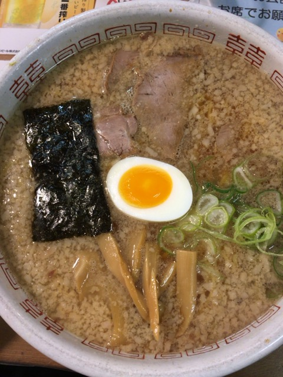
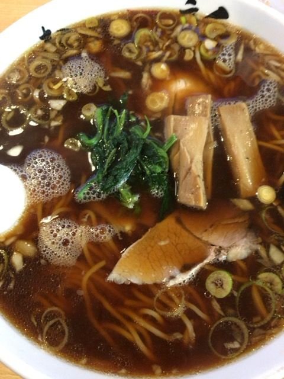
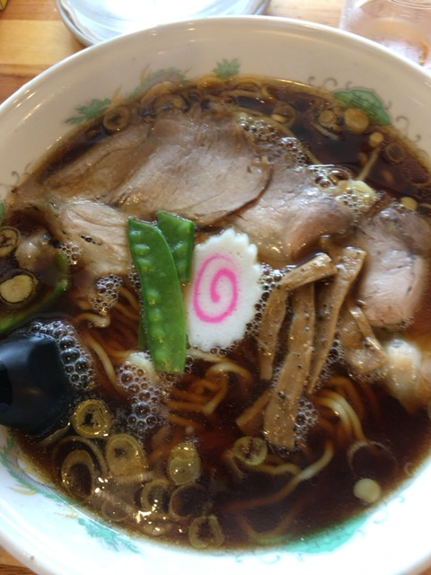
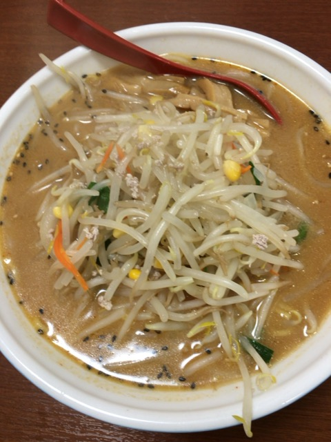

「新潟で美味しいものは何ですか？」

という質問をされたらお米やお酒などではなく”ラーメン”と答える新潟県民も多いと思います（笑）  それくらい新潟のラーメンはレベルが高いです。

そして、南魚沼にも美味しいラーメン屋さんが多いです！

その中で個人的なおすすめ店を紹介します。南魚沼に来る際は参考にしてみてください〜

---
 

次の4項目を1~5段階で評価します。

- 種類（少ない：１〜多い：５）
- 価格帯（高い：１〜安い：５）
- 麺の量（少ない：１〜多い：５）
- オリジナリティ

味は系統によって評価基準が変わるのでコメントで。

では早速、紹介いたします。

###1.みつや

種類：５,
価格帯：４,
麺の量：４,
オリジナリティ：５

五日町という地域にあるこのお店は醤油・塩・味噌の３種類から選べて、さらに背脂の量や麺の量、麺の太さも変えられます。

自分は初見のラーメン屋は基本的に醤油を選ぶのですが、知り合いにおすすめされた味噌を食べました。

**結果、大正解でした！** 期待を大幅に上回る味噌ラーメンでした。

背脂苦手な人もいると思いますが、ここのはまったくクドくないです。他の味も食べてみたいですが、次行った時も味噌を頼みそうです（笑）
 
 
 

###2.一彰

種類：４,
価格帯：４,
麺の量：４,
オリジナリティ：３

こちらのお店も醤油・塩・味噌から選べます。
醤油は長岡生姜醤油系で個人的にとても好きな味です！

他の味も安定して美味しいです。ただ、他に似ているラーメンがあるのでオリジナリティは３とさせていただきました。
 
 
 

###３.ヒグマ

種類：５,
価格帯：４,
麺の量：３,
オリジナリティ：３

こちらのお店も醤油・塩・味噌から選べます。
ヒグマは県内にもいくつかありますが、塩沢店は特に美味しいと思います。

スープは申し分ないのですが、麺の量はやや少なめです。しかし、特盛まで展開しているので、少し多めに頼んでいいと思います。
 
 
 

###4.どさんこ

種類：５,
価格帯：３,
麺の量：４,
オリジナリティ：４

どさんこは北海道ラーメンで味噌が有名です。味噌ラーメンは野菜がたっぷり入っています。根強い人気店です。

ラーメン屋ですが、居酒屋メニューも豊富です！
 
 
 

以上、４店舗の紹介でした〜

他にも行ったことないお店がたくさんあるので食べに行ってみたいと思います！