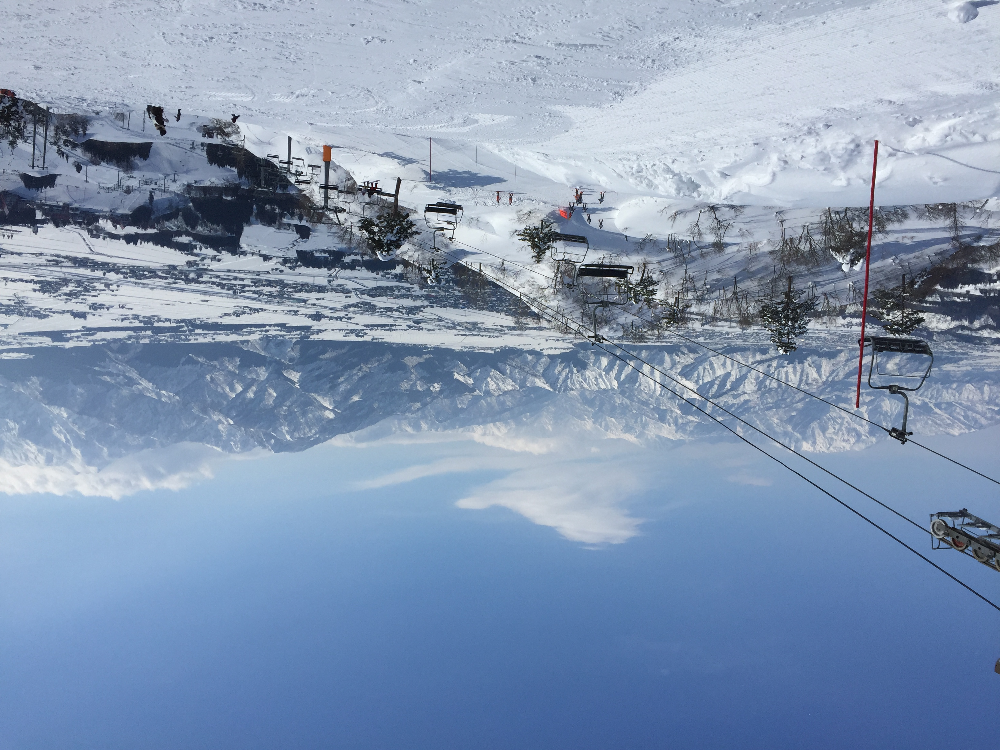
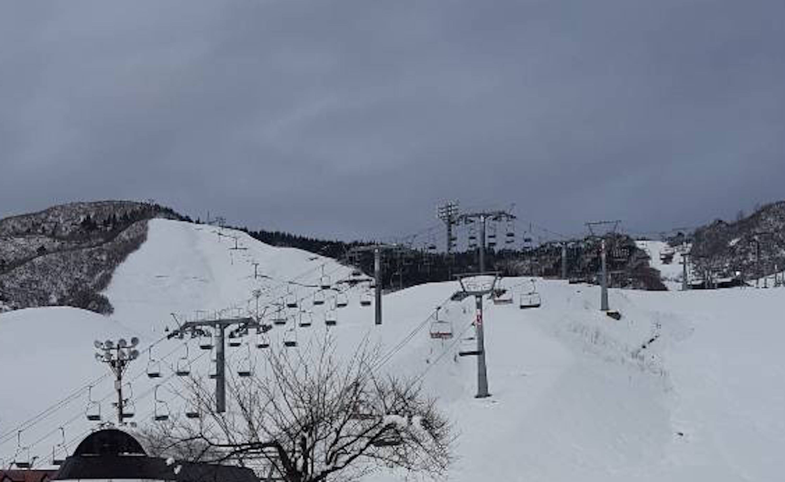
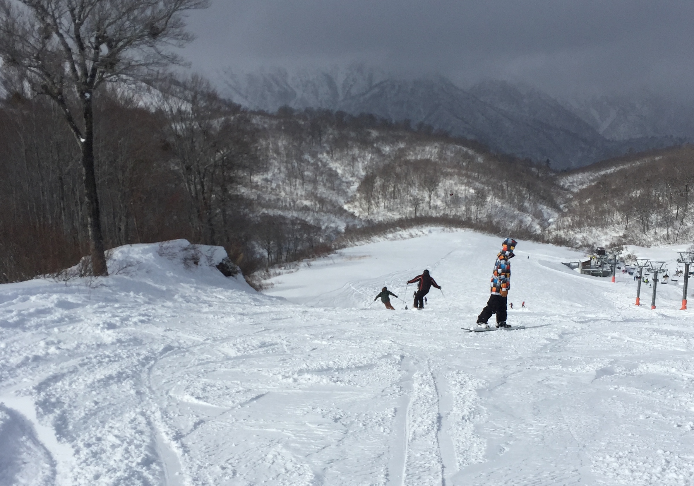

この記事はスキー場のリフトでバイトしていた自分の経験に基づく、スキー場に遊びに行く際に参考にしていただきたい内容です！

---

##リフト

まずは、リフトについてです。

###【普通に乗っているとわからないリフトのこと】
1.リフトは自動でゆっくりになっているのではない 
監視役の人が時と場合によって減速モードに変えています。なるべくタイミングよく座るポイントに進みましょう。

2.乗り場周辺で撒いているアレは塩ではない 
塩ではなく、「**硫安**」と言います。（正確には硫酸アンモニウム）

3.リフト小屋の窓を鏡がわりにする 
場所によりますが、外から見えにくい反射シールを貼っています。したがって、窓にキメ顔している人は監視役から丸見えです（笑）。
 
 

###【危ないからやめたほうがいい、やめてほしい】

- ギリギリに乗る

これ、主に２人組の後から乗る方に多いのですが、上で述べた通り**監視役の人がその都度減速をかけています。** いくらリフトに乗ることが慣れていても、万が一のためにゆっくりにしなければいけません。

- 小さな子供をイスの内側（柱側）に乗せる

たまに子供を先に乗らせようとして、自分が外側に座る方がいますが、これは降りるときに危険です。**係員が補助できるようにお子さんは外側に。**   特に本人もあまり慣れていない場合は自分でやろうとせずに子供は係員に任せ、自分が乗ることに気を配りましょう。

- ボードを抱えて乗る

リフト乗り場にボコボコと穴があき、あとの人が滑走しにくくなります。また、降りるときに搬器に膝が当たって危険です。 
これはスノーボード初心者の方に多いのですが、頑張ってボードを付けて乗ってみましょう。筆者も慣れるまで怖かったですが、**やってみないといつまでもできるようになりません。** コツとしては、なるべく一人で乗って降りるときはギリギリまで肘置きに捕まっていることです。

- 降り場付近で板を揺らす

ついついやってしまいがちですが、場所によっては斜面に板が刺さりそうで危険な時があります。また、バックルがうまくはまっていないとスキー板が吹っ飛びます。

- 子供にスキー板を履かせない

子供がスキー初心者だからといって、スキー板を履かせないのはかえって危険です。スキー靴はとても歩きにくいです、板は履かせてあげましょう。また、**平地である程度練習してから乗ることをお勧めします。**

---

##コース

続いて、コースでのマナーを２点ほど。

- コースの真ん中で長居しない

これはボーダーが集団でやってしまいがちなのですが、他の人が滑りにくいですし、事故の元です。転んでもすぐに立つか端に寄りましょう。

- 合流地点で止まらない

次々と人が降りてきます、すぐに進みましょう。リフト降り場でも共通です。

---
 
 

ここからは自分の中のあるあるです（笑）
 

###自分が見て上手いと思う人の特徴
 

上手い人の見た目の傾向です（笑）もちろん例外ありです。
 

・スキーヤー 
- スットクを股に挟んでリフトに乗る  
- ヘルメットor蛍光色レンズのゴーグル

・ボーダー 
- 覆面 
- ウェアがつなぎorカーキやブラウン系の地味な色

・子供 
- 乗るときに「お願いします」と言ってくれる 
- 乗り場でストックをあげている（雪に刺さない）

上手い人は**マナーもしっかりしている**印象です！

安全にスキー場を楽しみましょう〜