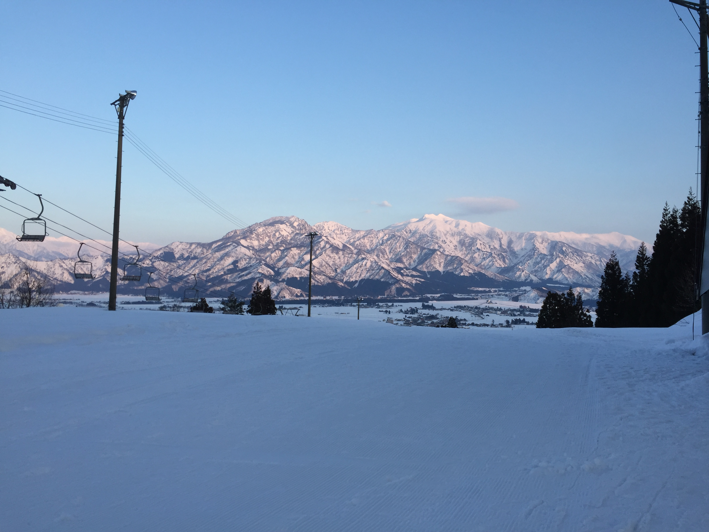

渋谷さんもおっしゃっていたように、南魚沼は作業環境に優れている点がいくつかあります。例えば…

- 米がうまい
- 空気が美味しい
- 騒音が少ない

などです！

今回のインターンのように都会では味わえない魅力を堪能しながら集中できる環境で、開発合宿を行うのもとてもいいと思います。

また、休みの日は広大なスキー場でウィンタースポーツを楽しめるのも魅力です。1日あっても滑りきれないような大きいスキー場がこのエリアには集中しています。

地方ならではの魅力を感じに、南魚沼でインターンや事業展開をする企業が増えればいいなと思います。

---
 

また、お隣の湯沢町にはバブル時に建てられたリゾートマンションが数多くあります。しかし、今は観光客の減少によりあまり利用されておらず、**格安で**売られています！

このようなリゾートマンションを購入して、新たな拠点とするのも面白いなと思います！

メリットは

- 都心からのアクセスがいい（越後湯沢駅）
- スキー場、プール、温泉など施設豊富
- フジロックの会場である苗場スキー場が近い

個人的にIT関係など、あまり場所にとらわれない企業におすすめだと思います。ぜひ参考にしてみてください！